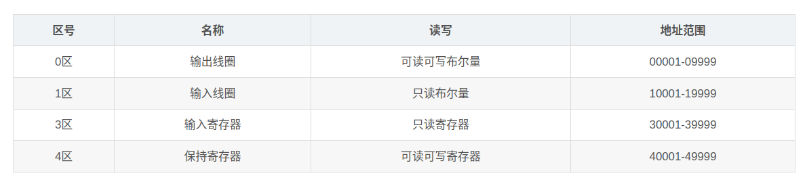
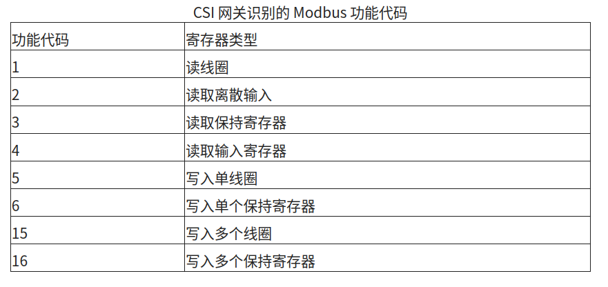

## 1.为什么为出现Modbus？

工业设备种类繁多且来自于不同的制造厂商，它们之间很难进行通信和协同工作，所以需要一个媒介进行通信，这种媒介就叫通信协议，而Modbus就是其中一个。

### 通信是什么？

简单来说就是设备之间的数据交换或信息共享。

### 协议是什么？

协议是一个汉语词汇，意思是共同计议，协商；经过谈判、协商而制定的共同承认、共同遵守的文件。

### 通信协议是什么？

通信协议是一组规则和约定，定义了数据在两个或多个电子设备之间传输的方式。

## 2.Modbus是什么？

Modbus是一种用于工业电子设备之间通信的协议。

Modbus 协议最常用的形式是 RS-485 上的 RTU。
Modbus RTU 是一种相对简单的串行协议，可以通过传统的 UART 技术传输。
数据以 8 位字节的形式传输，每次一位，波特率范围从 1200 比特每秒 (baud) 到 115200 比特每秒。

### 什么是RS-485？

RS485是一种电平标准。数据在双方传输，本质上是传输物理的电平（电压），RS485在压差-2～-6V时传输0,+2～+6V时传输1。

### 什么是RTU？

RTU 是 Modbus 协议的一种传输模式，其他还有ASCII与TCP。

### 什么是串行协议？

串行协议是一种数据传输方式，数据位逐个顺序传输，也就是说，每次传输一位（bit）。

### 什么是UART(Universal Asynchronous Receiver/Transmitter)？

UART（通用异步收发器）是一种串行通信硬件，用于在计算机或其他设备之间进行串行数据传输。

### 什么是字节？

字节是计算机数据的一种基本单位，通常由 8 位（bit）组成。每个字节可以表示 0 到 255 的整数值，或者一个字符。

### 什么是波特率？

波特率是指串行通信中数据传输的速率，即每秒传输的符号（信号变化）的数量。对于 Modbus RTU 和大多数串行通信，波特率也代表每秒钟传输的位数（bps，bit per second）。

## 3.Modbus有什么用？

Modbus的主要用途是在工业自动化系统中实现设备间的通信。

Modbus 是一种主从协议（Master/Slave），允许主设备（如 PLC、SCADA 系统、工控机）与多个从设备（如传感器、执行器、变频器、远程 I/O 模块等）进行通信。
通过 Modbus，主设备可以读取从设备的数据，也可以向从设备发送控制指令。

Modbus是一主多从的通信协议，Modbus通信中只有一个设备可以发送请求，其他从设备接收主机发送的数据来进行响应。

## 4.Modbus怎么用？

每次数据交换都由主设备发出的请求和从设备发出的响应组成。
每个数据包（无论是请求还是响应）都以设备地址或从设备地址开头，然后是功能代码，最后是定义请求或提供内容的参数。

从机存储数据，Modbus协议规定了4个存储区，分别是0、1、3、4区，其中0区和4区是可读可写，1区和3区是只读。

并且存储的数据类型可以分为 ：布尔量 和 16位寄存器

### 4种数据类型

Modbus协议规定，进行读写操作的数据类型，按照读写属性和类型可分为以下4种：

- 线圈（Coils）：1位，读写

- 离散输入（Discretes Input）：1位，只读

- 输入寄存器（Input Registers）：16位，只读

- 保持寄存器（Holding Registers）：16位，读写

Modbus 协议定义了几个用于访问 Modbus 寄存器的功能代码。
Modbus 定义了四个不同的数据块，每个数据块中的地址或寄存器编号重叠。
因此，要完整定义在何处查找数据，需要地址（或寄存器编号）和功能代码（或寄存器类型）。

### 3种传输模式

传输模式总的可分为两个传输模式：基于串行链路的和基于以太网TCP/IP的。常见的有以下三种：

- 基于串口的Modbus-RTU

Modbus RTU 是 Modbus 协议的二进制实现版本。它通常用于串行通信，并以其紧凑的数据表示方式而闻名，这使得它具备高效和快速的特点。

- 基于串口的Modbus-ASCII

Modbus ASCII 是 Modbus 协议的 ASCII 实现版本。与 Modbus RTU 相比，它的效率较低，但由于使用人类可读的字符，因此更容易使用和调试。

- 基于网口的Modbus-TCP

Modbus TCP 是 Modbus 协议的以太网版本，它使用 TCP/IP 协议栈进行通信，适用于现代工业网络环境。

所以当我们提及Modbus协议时，要确定是哪种模式：RTU、ASCII或TCP，3种模式区别还是很大的。

## 参考：

- https://www.csimn.com/CSI_pages/Modbus101.html
- https://zh.wikipedia.org/wiki/Modbus
- https://developer.aliyun.com/article/1078425
- https://blog.csdn.net/as480133937/article/details/123197782
- https://www.emqx.com/zh/blog/modbus-protocol-the-grandfather-of-iot-communication#modbus-%E5%8D%8F%E8%AE%AE%E7%9A%84%E5%BA%94%E7%94%A8