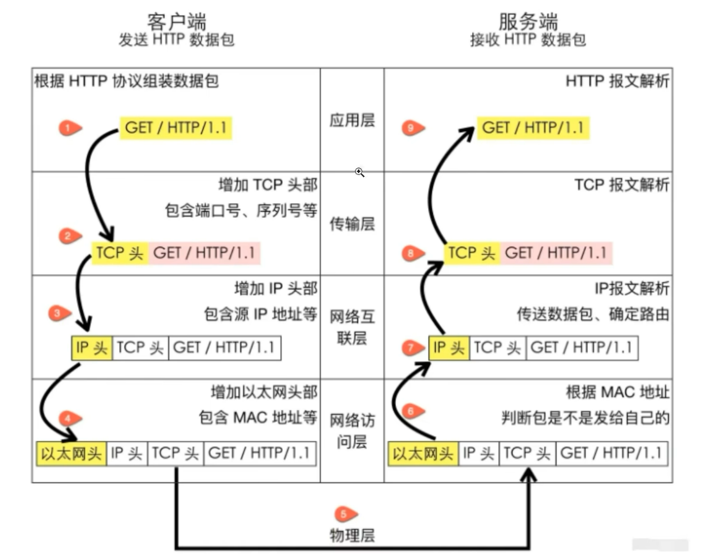

## TCP/IP是什么？
TCP/IP（Transmission Control Protocol，传输控制协议/Internet Protocol，互联网协议）是一组用于互联网和许多现代网络通信的协议。

TCP协议：提供端到端的稳定的数据传输协议。

IP协议：提供地址，将数据准确传输到目的地。IP协议不保证数据包的可靠传输，这部分功能由上层协议（如TCP）来实现。

## TCP/IP 协议模型
TCP/IP 协议模型分四层，每层传递的信息都不同。
1. 应用层
2. 传输层（TCP）
3. 网络层（IP）
4. 链路层（物理层）
 

## TCP三次握手
首先客户端向服务器发起请求，然后服务器响应客户端，最后客户端回应服务器。

## 子网掩码
截取IP前面N位作为子网ID。

子网掩码通过与IP地址进行按位与运算，可以分离出网络部分和主机部分。例如：
- IP地址：192.168.1.10
- 子网掩码：255.255.255.0

## 网关
常见的网关(有ip地址)为路由器，即将几个设备组成内网，然后通过路由器跟外部通讯。

